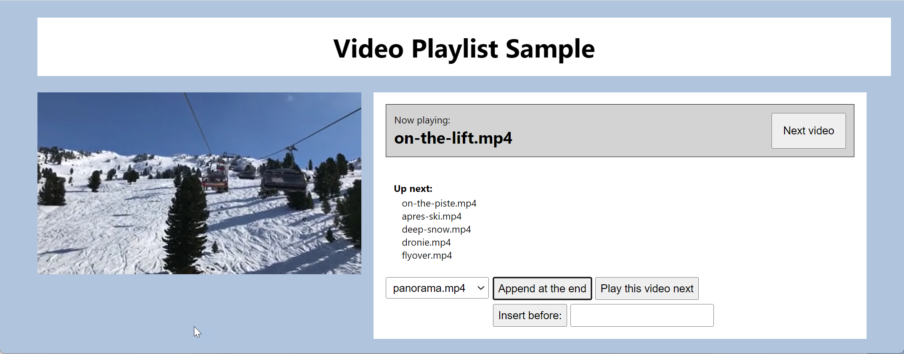

# Video Playlist Queue

## Introduction

This exam assesses your ability to implement, test, and integrate a video playlist management system in C#. You are provided with the foundational code for a [`TitleQueue` class](./template/VideoPlaylist.Logic/TitleQueue.cs), which represents a queue of movie titles. Your task is to implement the methods in the `TitleQueue` class. Additionally, you will utilize [unit tests](./template/VideoPlaylist.Tests/), a [console application](./template/VideoPlaylist.ConsoleApp/), and a [Blazor web application](./template/VideoPlaylist.Web/) to test the functionality of your implementation.

## Your Tasks

### General Remarks

The detailed requirements are specified as comments before each method that you have to complete. Make sure to read the methods' documentation carefully!

Rules of the exercise:

1. You **must not** change the method signatures.
2. You **must** use all of the given classes, properties, constructors, and methods.
3. You **can** add additional classes, properties, constructors, and methods.

### Basic Requirements

- Implement the following methods in the [`TitleQueue` class](./template/VideoPlaylist.Logic/TitleQueue.cs):
  - `Append`
  - `InsertAfterFirst`
  - `Next`
  - `CurrentlyPlaying`
- Implement the following method in [*Program.cs* in the console app](./template/VideoPlaylist.ConsoleApp/Program.cs):
  - `ViewAllMovies`
- You can use the provided unit tests to validate your implementation.
- Additionally, you can test your implementation in the console application.

### Advanced Requirements

- Implement **all** methods in the `TitleQueue` class.
- You can use the provided unit tests to validate your implementation.
- Additionally, you can test your implementation in a Blazor web application with a real video player.
