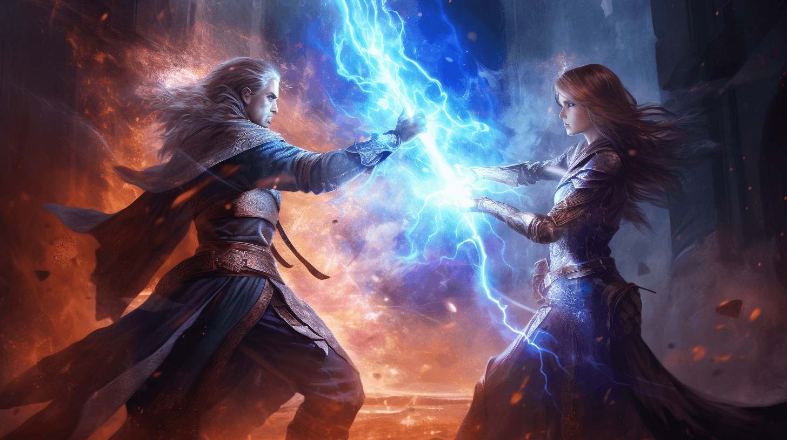

# Role Playing Game

## Description

You are one of the developers of a role-playing game (RPG). Your job is to implement a class hierarchy for the different characters, their attacks and defenses, and for executing in-game fights.

Here are the rules.

### Attacks

Every form of attack inflict a certain amount of base damage. However, the actual damage inflicted depends on a random factor to make the game more interesting.

There are two forms of attacks in the game:

1. _Weapon_: Weapons do between 50% and 100% of their base damage.
2. _Attack Spell_: Spells do not always work, they only work in 80% of the cases. If they work, they do their full damage, otherwise they do no damage.

### Defenses

Every form of defense reduces the damage taken from an attack. Every defense has a base value for the damage reduction. However, the actual damage reduction partly depends on a random factor to make the game more interesting.

There are two forms of defense in the game:

1. _Shield_: Shields offer between 75% and 100% of their base defense value.
2. _Armor_: Armors always offer their full defense value.

### Characters

Every character has a certain number of initial health points (should be set to 100 by default). Additionally, every character has a name (e.g. _Aeliana the Shieldmaiden_).

There are three types of characters in the game:

1. _Warrior_: Warriors have _one_ way to attack and _one_ defense.
2. _Mage_: Mages are attack specialists. They only have one way to attack, but _no_ defense.
3. _Rogue_: Rogues are also attack specialists. They have _two_ ways to attack, but no defense.

### Fights

A fight happens between two characters. Here are the fight rules:

1. Both characters start with their initial health points.
2. The character who attacks first is chosen randomly.
3. Calculate the damage inflicted by the attacker and the defense of the defender based on the rules above.
4. Subtract the defense from the damage. If the result is positive, subtract it from the defender's health points.
5. If the defender's health points have become negative, the attacker has won.
6. Otherwise, the roles are reversed and the fight continues with step 3.
7. Continue until one of the characters has won.

## Requirements **for Experts**

**Do not take a look at the detailed, technical requirements**. Try to implement the game logic described above on your own in a class library. Come up with your own class design. Write a console application with which you can test your logic.

## Requirements

Implement the application as specified in the [detailed, technical requirements](requirements.md).
