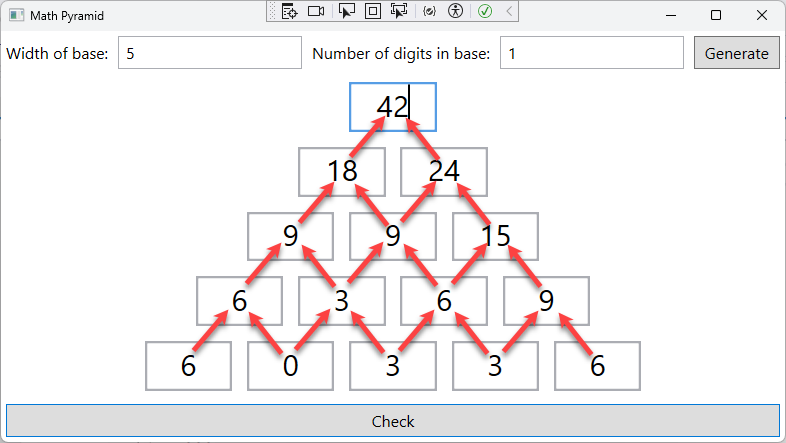
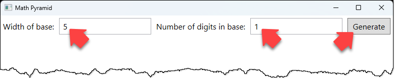
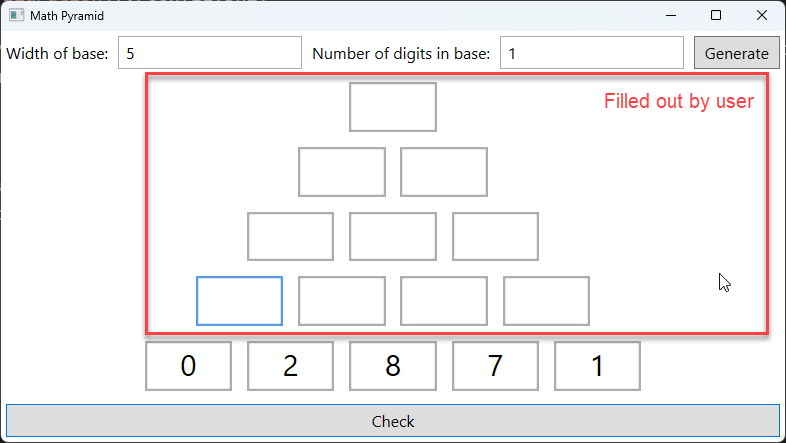
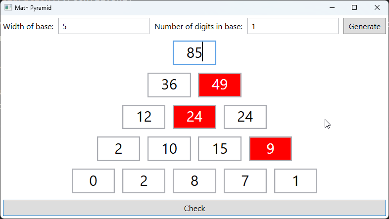
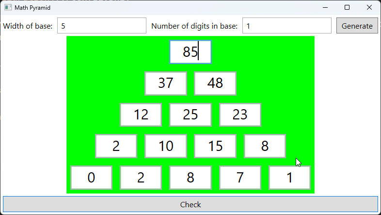
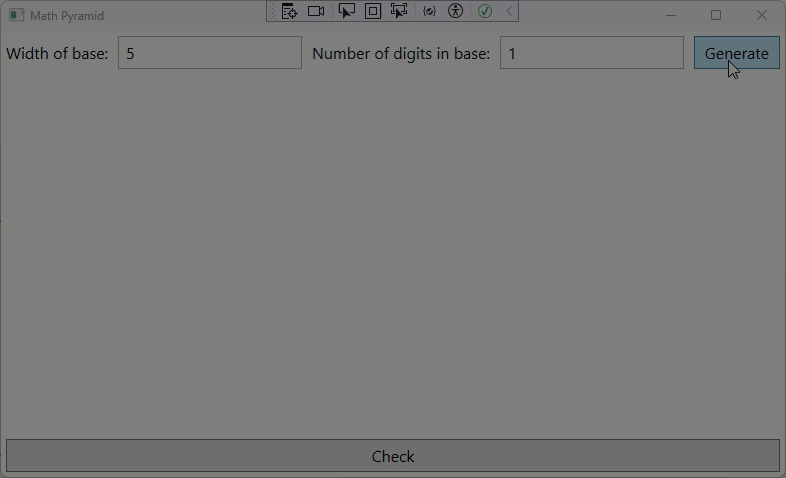
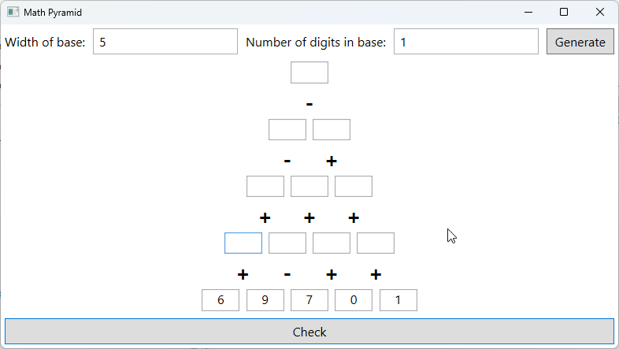

# Math Pyramid

## Introduction

Your job is to build a WPF app that helps elementary school students to practice addition. The app will display a pyramid of numbers, where each number is the sum of the two numbers below it.

After the program starts, the user can choose the width of the pyramid's base (i.e. how many random numbers are in the bottom row). Additionally, the user can choose whether the numbers in the base have max. one or max. two digits. The user can then click a button to generate the pyramid.

The pyramid contains random numbers in the bottom row. The user must fill out the rest of the pyramid by calculating the sum of the two numbers below each number.

The user can click a button to check the result. If the result is incorrect, the number is displayed in red.

If all numbers are correct, the pyramid is displayed with a green background.

Here is a screen video showing the entire process:

## Starter Code

The folder [_Starter_](./Starter/) contains starter code for the project. It should make it easier for you to get started.

## Requirements

### Base Requirements

If this exercise was an exam, you would have to implement the following features _without internet access_ to pass:

* Adding the parameter form at the top of the window.
    * Display a message box if the user enters invalid values in the parameter form.
* Adding the "Check" button at the bottom of the window.
* Generate the text boxes for the pyramid if the user presses the "Generate" button.
    * The bottom row of the pyramid must contain random numbers.

For just passing the exam, the UI does not have to look exactly like the screenshots.

### Advanced Requirements

If you want to score extra points, implement the following features:

* Implement the "Check" button.
    * Implement the checking logic.
* Visualize the checking result.
    * If the user's answers are correct, the pyramid should be displayed with a green background.
    * If the user's answers are incorrect, the incorrect numbers should be displayed in red.
* Try to make the UI look like the screenshots as much as possible.

You can find a sample solution in the folder [_BaseVersion_](./BaseVersion). Once you completed your solution, you can compare it with the sample solution. It contains some additional tips and tricks that we have not yet covered in the course. They are not necessary to solve the exercise, but they can help you to improve your WPF skills.

### Hard Mode

Do you want an extra challenge that goes beyond what is required in the upcoming exam? Let the user practice addition and subtraction by randomly choosing between the two operations.

The rest of the program should work the same way as in the base requirements.

You can find a sample solution in the folder [_AdvancedVersion_](./AdvancedVersion).
