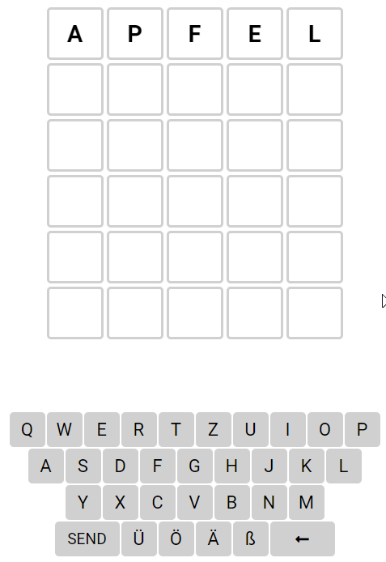

# Wordle

## Description

Do you know the famous word guessing game _wordle_? It is available [in English](https://www.nytimes.com/games/wordle/index.html) and [in German](https://www.xn--wrdle-jua.de/) (and of course in many other languages, but we focus on these two). First, make yourself familiar with the game by playing a few rounds.

In this exercise, you have to implement _wordle_ with WPF and C#. You can choose whether you want to implement the English or the German version. In contrast to the original game, players get a random word to guess every time they start the app.

## Words

You do not need to invent your own words. You can use the following lists of words:

* English
  * [_available-words-en.txt_](./available-words-en.txt) contains all the words that a user is allowed to guess. Other combinations of letters are not allowed.
  * [_words-to-guess-en.txt_](./words-to-guess-en.txt) contains all the words that the app can choose from. All words in this list are also in the list of available words.
* German
  * [_available-words-de.txt_](./available-words-de.txt) contains all the words that a user is allowed to guess. Other combinations of letters are not allowed.
  * [_words-to-guess-de.txt_](./words-to-guess-de.txt) contains all the words that the app can choose from. All words in this list are also in the list of available words.

## Level 1 - UI

The first and most important part of this exercise is the user interface:



Use XAML and WPF to build a UI that is as close as possible to the original game (see image above).

## Level 2 - Guessing

Level 2 starts by selecting a random word to guess.

Next, let the user enter words by clicking on the in-app keyboard. When the user clicks on a letter, the letter should be added to the current guess. When the user presses _send_, you have to check whether the word is in the list of available words. If it is not, you do _not_ need to implement the animation from the original game. Instead, you can simply display a message box that tells the user that the word is not in the list of available words.

If the word is in the list of available words, you have to check whether the word is the correct word. If it is, you have to display a message box that tells the user that they have won the game. If it is not, progress to the next line. If the user has made six incorrect guesses, you have to display a message box that tells the user that they have lost the game.

## Level 3 - Visualize Correct Characters

When the user has made a guess, you have to visualize which characters are correct. You can use the following colors:

* Green: The character is correct and in the correct position.
* Yellow: The character is correct but in the wrong position.
* Gray: The character is not in the word.

## Level 4 - Guesses in Keyboard

Indicate the letters that the user has already guessed in the in-app keyboard. Use the same colors as in Level 3.

## Level 5 - Keypress

Allow the user to enter letters by pressing the corresponding key on the keyboard.

Here is some sample code demonstrating how you react to key presses:

```cs
public partial class MainWindow : Window
{
    public MainWindow()
    {
        InitializeComponent();
        Focusable = true;
        Loaded += (sender, eventArgs) => Focus();
        KeyDown += (sender, eventArgs) =>
        {
            // Handle the pressed key here
            MessageBox.Show($"Key: {eventArgs.Key}");
        };
    }
}
```

## Level 6 - Animation

Add animations where appropriate. Here is some sample code for inspiration:

```xml
<Window x:Class="WpfApp7.MainWindow"
        xmlns="http://schemas.microsoft.com/winfx/2006/xaml/presentation"
        xmlns:x="http://schemas.microsoft.com/winfx/2006/xaml"
        xmlns:d="http://schemas.microsoft.com/expression/blend/2008"
        xmlns:mc="http://schemas.openxmlformats.org/markup-compatibility/2006"
        xmlns:local="clr-namespace:WpfApp7"
        mc:Ignorable="d"
        Title="MainWindow" Height="450" Width="800">
    <Window.Resources>
        <Storyboard x:Key="WiggleAnimation">
            <DoubleAnimationUsingKeyFrames Storyboard.TargetProperty="(UIElement.RenderTransform).(TranslateTransform.X)">
                <!-- Duration of 2 seconds -->
                <EasingDoubleKeyFrame KeyTime="0:0:0.1" Value="-10"/>
                <EasingDoubleKeyFrame KeyTime="0:0:0.2" Value="10"/>
                <EasingDoubleKeyFrame KeyTime="0:0:0.3" Value="-10"/>
                <EasingDoubleKeyFrame KeyTime="0:0:0.4" Value="0"/>
            </DoubleAnimationUsingKeyFrames>
        </Storyboard>
    </Window.Resources>
    <Button Margin="50" Content="Hello" Click="OnClick" Name="MyButton">
        <Button.RenderTransform>
            <TranslateTransform />
        </Button.RenderTransform>
    </Button>
</Window>
```

```cs
using System.Windows;
using System.Windows.Media.Animation;

namespace WpfApp7;

/// <summary>
/// Interaction logic for MainWindow.xaml
/// </summary>
public partial class MainWindow : Window
{
    public MainWindow()
    {
        InitializeComponent();
    }

    private void OnClick(object sender, RoutedEventArgs e)
    {
        Storyboard wiggleStoryboard = (Storyboard)FindResource("WiggleAnimation");
        wiggleStoryboard.Begin(MyButton);
    }
}
```
