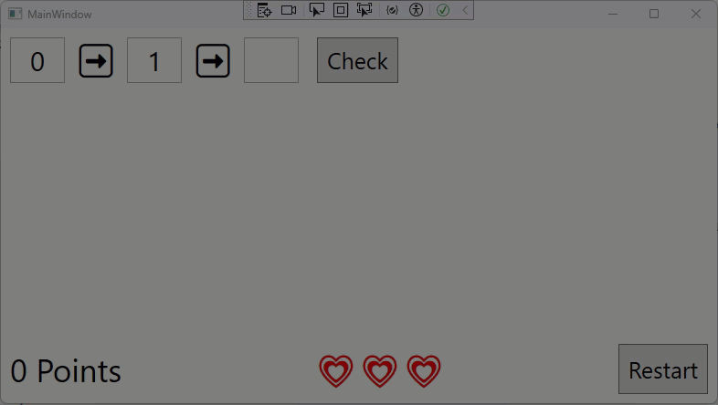

# Fibonacci Game

## Introduction

Your job is to implement a math game based on the Fibonacci sequence.

The game starts with displaying the first two numbers: 0 and 1. The player has to calculate the next value in the Fibonacci sequence and enter it. If the player's answer is correct, the entered number appears in the sequence and the player has to guess the next number.

For each correct answer, the player gets points based on the following formula: _Number of digits in the correct answer_ ^ 2. Examples:

| Correct answer | Points |
| -------------- | ------ |
| 1              | 1      |
| 8              | 1      |
| 13             | 4      |
| 144            | 9      |

The player starts with three lives. If the player enters an incorrect answer, they lose one life. The game ends when the player has no lives left.

At any point in the game, the player can restart the game. If the player has lost all lives, they can also restart the game.

Here is a screen video showing the game in action:

## Requirements

### Base Requirements

You need to solve the following requirements to pass the exam:

* When the game starts, the player sees the first two numbers in the Fibonacci sequence: 0 and 1.
* The player can enter the next number.
* Try to rebuild the UI from the screen video as closely as possible.
  * Tip: Use a `WrapPanel` to display the sequence of numbers. The syntax is very similar to a `StackPanel`. If necessary, lookup the documentation for the `WrapPanel` online.
* If the player's answer is correct, the entered number is added to the sequence and the player has to guess the next number.
* If the player's answer is incorrect, display a message box with the content _That is wrong_.
* No points
* No lives
* No restart option

### Level 2

Add point calculation and output.

### Level 3

Add _Restart_ button and logic.

### Level 3

Add lives and _Game Over_ logic (including restart option on _Game Over_ screen).
